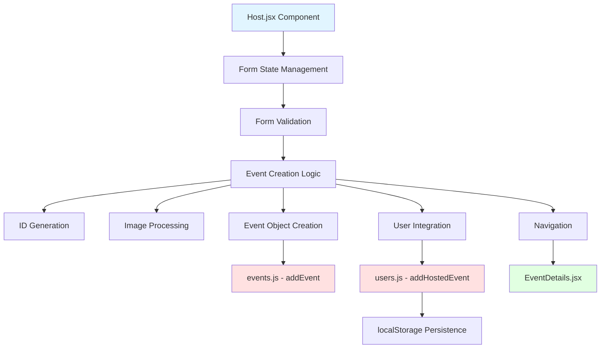

# Design Document: Functional Event Hosting

## Overview

This design implements a fully functional event hosting feature for the Milo social event platform. The feature enables authenticated users to create new events through a form interface, with automatic state management, validation, unique ID generation, image handling, and seamless integration with the existing event and user data structures. Upon successful creation, users are redirected to the newly created event's detail page where they can manage it as the host.

The implementation follows React functional component patterns with hooks, integrates with React Router for navigation, and uses localStorage for client-side persistence following existing patterns in the codebase.

## Architecture



## Main Algorithm/Workflow

```mermaid
sequenceDiagram
    participant User
    participant HostForm as Host.jsx
    participant Validation as Validation Logic
    participant EventData as events.js
    participant UserData as users.js
    participant Storage as localStorage
    participant Router as React Router
    participant Details as EventDetails.jsx
    
    User->>HostForm: Fill form & submit
    HostForm->>Validation: Validate form data
    alt Validation fails
        Validation-->>HostForm: Return errors
        HostForm-->>User: Display errors
    else Validation passes
        Validation-->>HostForm: Valid data
        HostForm->>HostForm: Generate unique ID
        HostForm->>HostForm: Process image
        HostForm->>EventData: addEvent(newEvent)
        EventData-->>HostForm: Event added
        HostForm->>UserData: addHostedEvent(eventId)
        UserData->>Storage: Persist user.hosted
        UserData-->>HostForm: Success
        HostForm->>Router: navigate(/event/{id})
        Router->>Details: Load event page
        Details-->>User: Show event (with host controls)
    end
```

## Components and Interfaces

### Component 1: Host.jsx (Enhanced)

**Purpose**: Event creation form with complete state management, validation, and submission logic

**Interface**:
```typescript
interface HostFormState {
  title: string
  description: string
  categories: string[]  // Changed from single to multi-select
  date: string
  time: string
  location: string
  spots: number
  image: File | null
  imagePreview: string | null
}

interface FormErrors {
  title?: string
  description?: string
  categories?: string
  date?: string
  time?: string
  location?: string
  spots?: string
  image?: string
}

function Host(): JSX.Element
```

**Responsibilities**:
- Manage form state using React hooks (useState)
- Handle multi-select category selection
- Validate all form inputs before submission
- Process image file upload and generate preview
- Generate unique event ID
- Create event object matching existing structure
- Call addEvent() to persist event
- Call addHostedEvent() to update user's hosted array
- Navigate to new event detail page on success
- Display validation errors to user

### Component 2: events.js (Enhanced)

**Purpose**: Event data management with add functionality

**Interface**:
```typescript
interface Event {
  id: string
  title: string
  host: string
  date: string
  time: string
  location: string
  image: string
  tags: string[]
  description: string
  spots: number
  joined: number
}

export const events: Event[]
export function deleteEvent(id: string): boolean
export function addEvent(event: Event): { success: boolean; event?: Event; error?: string }
```

**Responsibilities**:
- Maintain events array
- Add new events to array
- Validate event structure before adding
- Return success/error status

### Component 3: users.js (Enhanced)

**Purpose**: User management with hosted event tracking

**Interface**:
```typescript
export function addHostedEvent(eventId: string): { success: boolean; user?: User; error?: string }
```

**Responsibilities**:
- Add event ID to active user's hosted array
- Persist changes to localStorage
- Validate user is authenticated
- Return success/error status

## Data Models

### Model 1: Event

```typescript
interface Event {
  id: string              // Unique identifier (kebab-case from title + random)
  title: string           // Event title
  host: string            // Host name (from active user)
  date: string            // Format: "Day, Mon DD" (e.g., "Sun, May 18")
  time: string            // Format: "HH:MM AM/PM" (e.g., "11:00 AM")
  location: string        // Location description
  image: string           // Image URL or data URL
  tags: string[]          // Category tags (multi-select)
  description: string     // Event description
  spots: number           // Maximum participants
  joined: number          // Current participant count (starts at 0)
}
```

**Validation Rules**:
- `id`: Must be unique, kebab-case format
- `title`: Required, 3-100 characters
- `host`: Required, from active user
- `date`: Required, must be future date
- `time`: Required, valid time format
- `location`: Required, 3-100 characters
- `image`: Required, valid image file
- `tags`: At least 1 category selected
- `description`: Required, 20-500 characters
- `spots`: Required, minimum 2, maximum 100
- `joined`: Always starts at 0

### Model 2: FormData

```typescript
interface HostFormData {
  title: string
  description: string
  categories: string[]
  date: string           // ISO date string from input
  time: string           // HH:MM format from input
  location: string
  spots: number
  image: File | null
  imagePreview: string | null
}
```

**Validation Rules**:
- All fields required except imagePreview
- `categories` must have at least one selection
- `date` must be today or future
- `spots` must be between 2 and 100
- `image` must be valid image file (jpg, png, webp)

## Key Functions with Formal Specifications

### Function 1: generateEventId()

```typescript
function generateEventId(title: string): string
```

**Preconditions:**
- `title` is non-empty string
- `title` contains at least one alphanumeric character

**Postconditions:**
- Returns unique string in kebab-case format
- Format: `{kebab-case-title}-{random-4-chars}`
- Result matches pattern: `/^[a-z0-9]+(-[a-z0-9]+)*-[a-z0-9]{4}$/`
- Generated ID is unique (not in existing events array)

**Loop Invariants:** N/A (no loops)

### Function 2: validateForm()

```typescript
function validateForm(formData: HostFormData): { isValid: boolean; errors: FormErrors }
```

**Preconditions:**
- `formData` is defined object with all required properties

**Postconditions:**
- Returns object with `isValid` boolean and `errors` object
- `isValid` is true if and only if all validation rules pass
- `errors` object contains field-specific error messages for failed validations
- No mutations to input parameter

**Loop Invariants:**
- For validation loops: All previously checked fields maintain their validation state

### Function 3: formatDateForDisplay()

```typescript
function formatDateForDisplay(isoDate: string): string
```

**Preconditions:**
- `isoDate` is valid ISO date string (YYYY-MM-DD format)

**Postconditions:**
- Returns formatted string in "Day, Mon DD" format
- Example: "2024-05-18" → "Sun, May 18"
- No side effects

**Loop Invariants:** N/A (no loops)

### Function 4: formatTimeForDisplay()

```typescript
function formatTimeForDisplay(time24: string): string
```

**Preconditions:**
- `time24` is valid 24-hour time string (HH:MM format)

**Postconditions:**
- Returns formatted string in 12-hour format with AM/PM
- Example: "14:30" → "2:30 PM"
- No side effects

**Loop Invariants:** N/A (no loops)

### Function 5: processImageFile()

```typescript
function processImageFile(file: File): Promise<string>
```

**Preconditions:**
- `file` is valid File object
- `file.type` starts with "image/"

**Postconditions:**
- Returns Promise that resolves to data URL string
- Data URL can be used as image src attribute
- Original file is not modified
- Rejects if file reading fails

**Loop Invariants:** N/A (async operation)

### Function 6: handleSubmit()

```typescript
function handleSubmit(e: FormEvent, formData: HostFormData, activeUser: User): void
```

**Preconditions:**
- `e` is valid form event
- `formData` contains all form fields
- `activeUser` is authenticated user object (not null)

**Postconditions:**
- Form submission is prevented (e.preventDefault())
- If validation fails: error state is updated, no navigation occurs
- If validation passes: event is created, user.hosted is updated, navigation to new event occurs
- All state updates are atomic

**Loop Invariants:** N/A (sequential operations)

## Algorithmic Pseudocode

### Main Event Creation Algorithm

```pascal
ALGORITHM handleEventSubmission(formData, activeUser)
INPUT: formData of type HostFormData, activeUser of type User
OUTPUT: navigation to new event page OR error display

BEGIN
  ASSERT activeUser ≠ null
  ASSERT formData is well-formed
  
  // Step 1: Validate form data
  validationResult ← validateForm(formData)
  
  IF NOT validationResult.isValid THEN
    displayErrors(validationResult.errors)
    RETURN
  END IF
  
  // Step 2: Generate unique event ID
  eventId ← generateEventId(formData.title)
  
  ASSERT eventId is unique in events array
  ASSERT eventId matches kebab-case pattern
  
  // Step 3: Process image file
  imageDataUrl ← AWAIT processImageFile(formData.image)
  
  ASSERT imageDataUrl is valid data URL
  
  // Step 4: Format date and time for display
  displayDate ← formatDateForDisplay(formData.date)
  displayTime ← formatTimeForDisplay(formData.time)
  
  // Step 5: Create event object
  newEvent ← {
    id: eventId,
    title: formData.title,
    host: activeUser.name,
    date: displayDate,
    time: displayTime,
    location: formData.location,
    image: imageDataUrl,
    tags: formData.categories,
    description: formData.description,
    spots: formData.spots,
    joined: 0
  }
  
  ASSERT newEvent matches Event interface
  
  // Step 6: Add event to events array
  addResult ← addEvent(newEvent)
  
  IF NOT addResult.success THEN
    displayError(addResult.error)
    RETURN
  END IF
  
  // Step 7: Update user's hosted array
  hostResult ← addHostedEvent(eventId)
  
  IF NOT hostResult.success THEN
    // Rollback: remove event from array
    deleteEvent(eventId)
    displayError(hostResult.error)
    RETURN
  END IF
  
  // Step 8: Navigate to new event page
  navigate("/event/" + eventId)
  
  ASSERT user is now on event detail page
  ASSERT event detail page shows host controls
END
```

**Preconditions:**
- User is authenticated (activeUser exists)
- Form data is provided
- All required functions are available

**Postconditions:**
- If successful: new event exists in events array, user.hosted contains event ID, user is on event detail page
- If failed: no event is created, user remains on form with error messages
- No partial state (rollback on failure)

**Loop Invariants:** N/A (sequential operations with early returns)

### ID Generation Algorithm

```pascal
ALGORITHM generateEventId(title)
INPUT: title of type string
OUTPUT: uniqueId of type string

BEGIN
  // Step 1: Convert title to kebab-case
  kebabTitle ← title.toLowerCase()
  kebabTitle ← kebabTitle.replace(/[^a-z0-9]+/g, "-")
  kebabTitle ← kebabTitle.replace(/^-+|-+$/g, "")
  
  ASSERT kebabTitle is non-empty
  
  // Step 2: Generate random suffix
  randomChars ← generateRandomString(4, "abcdefghijklmnopqrstuvwxyz0123456789")
  
  ASSERT randomChars.length = 4
  
  // Step 3: Combine and verify uniqueness
  candidateId ← kebabTitle + "-" + randomChars
  
  WHILE events.some(e => e.id = candidateId) DO
    randomChars ← generateRandomString(4, "abcdefghijklmnopqrstuvwxyz0123456789")
    candidateId ← kebabTitle + "-" + randomChars
  END WHILE
  
  RETURN candidateId
END
```

**Preconditions:**
- title is non-empty string
- events array is accessible

**Postconditions:**
- Returns unique ID not in events array
- ID is in kebab-case format with 4-character random suffix
- ID contains only lowercase letters, numbers, and hyphens

**Loop Invariants:**
- candidateId format remains valid throughout uniqueness check loop
- randomChars always has length 4

### Form Validation Algorithm

```pascal
ALGORITHM validateForm(formData)
INPUT: formData of type HostFormData
OUTPUT: result of type { isValid: boolean, errors: FormErrors }

BEGIN
  errors ← empty object
  
  // Validate title
  IF formData.title.length < 3 OR formData.title.length > 100 THEN
    errors.title ← "Title must be between 3 and 100 characters"
  END IF
  
  // Validate description
  IF formData.description.length < 20 OR formData.description.length > 500 THEN
    errors.description ← "Description must be between 20 and 500 characters"
  END IF
  
  // Validate categories
  IF formData.categories.length = 0 THEN
    errors.categories ← "Please select at least one category"
  END IF
  
  // Validate date
  selectedDate ← new Date(formData.date)
  today ← new Date()
  today.setHours(0, 0, 0, 0)
  
  IF selectedDate < today THEN
    errors.date ← "Event date must be today or in the future"
  END IF
  
  // Validate time
  IF NOT isValidTimeFormat(formData.time) THEN
    errors.time ← "Please enter a valid time"
  END IF
  
  // Validate location
  IF formData.location.length < 3 OR formData.location.length > 100 THEN
    errors.location ← "Location must be between 3 and 100 characters"
  END IF
  
  // Validate spots
  IF formData.spots < 2 OR formData.spots > 100 THEN
    errors.spots ← "Participants must be between 2 and 100"
  END IF
  
  // Validate image
  IF formData.image = null THEN
    errors.image ← "Please upload a cover image"
  ELSE IF NOT isValidImageType(formData.image.type) THEN
    errors.image ← "Please upload a valid image file (JPG, PNG, or WebP)"
  END IF
  
  // Determine overall validity
  isValid ← (Object.keys(errors).length = 0)
  
  RETURN { isValid: isValid, errors: errors }
END
```

**Preconditions:**
- formData is defined object with all required properties

**Postconditions:**
- Returns validation result with isValid boolean
- errors object contains messages for all failed validations
- isValid is true if and only if errors object is empty
- No mutations to formData

**Loop Invariants:** N/A (sequential validation checks)

## Example Usage

```typescript
// Example 1: Complete form submission flow
import { useState } from "react"
import { useNavigate } from "react-router-dom"
import { getActiveUser } from "../data/users"
import { addEvent } from "../data/events"

function Host() {
  const navigate = useNavigate()
  const activeUser = getActiveUser()
  
  const [formData, setFormData] = useState({
    title: "",
    description: "",
    categories: [],
    date: "",
    time: "",
    location: "",
    spots: 10,
    image: null,
    imagePreview: null
  })
  
  const [errors, setErrors] = useState({})
  
  const handleSubmit = async (e) => {
    e.preventDefault()
    
    // Validate
    const validation = validateForm(formData)
    if (!validation.isValid) {
      setErrors(validation.errors)
      return
    }
    
    // Generate ID
    const eventId = generateEventId(formData.title)
    
    // Process image
    const imageUrl = await processImageFile(formData.image)
    
    // Create event
    const newEvent = {
      id: eventId,
      title: formData.title,
      host: activeUser.name,
      date: formatDateForDisplay(formData.date),
      time: formatTimeForDisplay(formData.time),
      location: formData.location,
      image: imageUrl,
      tags: formData.categories,
      description: formData.description,
      spots: formData.spots,
      joined: 0
    }
    
    // Add to events
    const result = addEvent(newEvent)
    if (result.success) {
      addHostedEvent(eventId)
      navigate(`/event/${eventId}`)
    }
  }
  
  return <form onSubmit={handleSubmit}>...</form>
}
```

```typescript
// Example 2: Multi-select category handling
const [selectedCategories, setSelectedCategories] = useState([])

const toggleCategory = (category) => {
  setSelectedCategories(prev => 
    prev.includes(category)
      ? prev.filter(c => c !== category)
      : [...prev, category]
  )
}

// In render:
{interests.map(interest => (
  <button
    key={interest}
    type="button"
    onClick={() => toggleCategory(interest)}
    className={selectedCategories.includes(interest) ? "chip-active" : "chip"}
  >
    {interest}
  </button>
))}
```

```typescript
// Example 3: Image upload with preview
const handleImageChange = (e) => {
  const file = e.target.files?.[0]
  if (!file) return
  
  setFormData(prev => ({ ...prev, image: file }))
  
  // Generate preview
  const reader = new FileReader()
  reader.onloadend = () => {
    setFormData(prev => ({ ...prev, imagePreview: reader.result }))
  }
  reader.readAsDataURL(file)
}
```

## Correctness Properties

### Property 1: Event ID Uniqueness
**Statement**: ∀ events e1, e2 ∈ events array, e1.id = e2.id ⟹ e1 = e2

**Verification**: ID generation algorithm includes uniqueness check loop that ensures no duplicate IDs are created.

### Property 2: Host Attribution
**Statement**: ∀ event e ∈ events array, ∃ user u ∈ users where e.id ∈ u.hosted ∧ e.host = u.name

**Verification**: Event creation algorithm atomically adds event to events array and event ID to user.hosted array, using the same user object for both operations.

### Property 3: Form Validation Completeness
**Statement**: ∀ formData f, validateForm(f).isValid = true ⟹ f satisfies all Event interface requirements

**Verification**: Validation algorithm checks all required fields and constraints before returning isValid = true.

### Property 4: Data Persistence
**Statement**: ∀ event e created successfully, e persists in events array ∧ e.id persists in activeUser.hosted in localStorage

**Verification**: addEvent() adds to events array, addHostedEvent() updates user object and calls localStorage.setItem().

### Property 5: Navigation Consistency
**Statement**: ∀ successful event creation with ID i, navigation occurs to /event/i ∧ EventDetails.jsx displays host controls

**Verification**: handleSubmit calls navigate() only after successful addEvent() and addHostedEvent(), EventDetails.jsx checks activeUser.hosted.includes(id) to show host controls.

### Property 6: Rollback on Failure
**Statement**: ∀ event creation attempt, (addEvent succeeds ∧ addHostedEvent fails) ⟹ event is removed from events array

**Verification**: handleSubmit algorithm includes rollback logic that calls deleteEvent() if addHostedEvent() fails after addEvent() succeeds.

### Property 7: Image Data Integrity
**Statement**: ∀ image file f uploaded, processImageFile(f) produces data URL d where d can be rendered as 

**Verification**: processImageFile uses FileReader.readAsDataURL() which produces valid data URL format.

### Property 8: Multi-Select Category Constraint
**Statement**: ∀ valid formData f, f.categories.length ≥ 1

**Verification**: validateForm checks categories.length > 0 and returns isValid = false if constraint violated.

## Error Handling

### Error Scenario 1: User Not Authenticated

**Condition**: User attempts to submit form without being logged in (activeUser is null)
**Response**: Display error message "You must be logged in to host an event"
**Recovery**: Redirect to login page with return URL to Host page

### Error Scenario 2: Form Validation Failure

**Condition**: User submits form with invalid or missing data
**Response**: Display field-specific error messages below each invalid input
**Recovery**: User corrects errors and resubmits; form state is preserved

### Error Scenario 3: Image Upload Failure

**Condition**: Image file cannot be read or processed
**Response**: Display error "Failed to process image. Please try a different file."
**Recovery**: User selects different image file

### Error Scenario 4: Duplicate Event ID (Rare)

**Condition**: Generated ID already exists in events array
**Response**: Automatically regenerate ID with new random suffix
**Recovery**: Automatic retry in generateEventId() loop until unique ID found

### Error Scenario 5: localStorage Quota Exceeded

**Condition**: Adding hosted event to localStorage fails due to quota
**Response**: Display error "Unable to save event. Please clear browser data and try again."
**Recovery**: User clears localStorage or browser cache; event remains in events array but not in user.hosted

### Error Scenario 6: Invalid Date Selection

**Condition**: User selects past date for event
**Response**: Display error "Event date must be today or in the future"
**Recovery**: User selects valid future date

## Testing Strategy

### Unit Testing Approach

**Test Coverage Goals**: 80%+ code coverage for all utility functions and validation logic

**Key Test Cases**:
1. **generateEventId()**
   - Test kebab-case conversion with various inputs
   - Test uniqueness guarantee with existing IDs
   - Test random suffix generation
   - Test special character handling

2. **validateForm()**
   - Test each validation rule independently
   - Test boundary conditions (min/max lengths, min/max spots)
   - Test date validation (past, present, future)
   - Test empty/null inputs
   - Test valid complete form data

3. **formatDateForDisplay()**
   - Test various ISO date inputs
   - Test edge cases (leap years, month boundaries)
   - Test output format consistency

4. **formatTimeForDisplay()**
   - Test 24-hour to 12-hour conversion
   - Test AM/PM assignment
   - Test midnight and noon edge cases

5. **processImageFile()**
   - Test valid image file processing
   - Test invalid file type rejection
   - Test data URL format output

### Property-Based Testing Approach

**Property Test Library**: fast-check (for JavaScript/TypeScript)

**Properties to Test**:

1. **ID Generation Uniqueness**
   ```typescript
   fc.assert(
     fc.property(fc.array(fc.string()), (titles) => {
       const ids = titles.map(generateEventId)
       const uniqueIds = new Set(ids)
       return ids.length === uniqueIds.size
     })
   )
   ```

2. **Validation Idempotence**
   ```typescript
   fc.assert(
     fc.property(fc.record(formDataArbitrary), (formData) => {
       const result1 = validateForm(formData)
       const result2 = validateForm(formData)
       return result1.isValid === result2.isValid
     })
   )
   ```

3. **Date Format Reversibility**
   ```typescript
   fc.assert(
     fc.property(fc.date(), (date) => {
       const isoString = date.toISOString().split('T')[0]
       const formatted = formatDateForDisplay(isoString)
       return formatted.length > 0 && formatted.includes(',')
     })
   )
   ```

### Integration Testing Approach

**Integration Test Scenarios**:

1. **Complete Event Creation Flow**
   - Mount Host component with authenticated user
   - Fill all form fields with valid data
   - Submit form
   - Verify event added to events array
   - Verify event ID added to user.hosted
   - Verify navigation to event detail page
   - Verify host controls visible on detail page

2. **Multi-Select Category Interaction**
   - Click multiple category buttons
   - Verify selectedCategories state updates
   - Verify visual feedback (chip-active class)
   - Submit form and verify tags array contains all selected categories

3. **Image Upload and Preview**
   - Select image file
   - Verify preview displays
   - Submit form
   - Verify image data URL stored in event object
   - Navigate to detail page and verify image renders

4. **Error Recovery Flow**
   - Submit form with missing fields
   - Verify error messages display
   - Correct errors
   - Resubmit and verify success

5. **Host Detection on Detail Page**
   - Create event as User A
   - Navigate to event detail page
   - Verify "Delete this Milo" button shows
   - Log out and log in as User B
   - Navigate to same event
   - Verify "Join this Milo" button shows (not delete)

## Performance Considerations

1. **Image Processing**: Use FileReader API for client-side image processing to avoid server uploads. Consider image compression for large files to reduce localStorage usage.

2. **Form State Updates**: Use functional setState updates to avoid unnecessary re-renders when updating nested form state.

3. **Validation Debouncing**: Consider debouncing validation on input change to reduce computation during typing (validate on blur or submit only).

4. **localStorage Efficiency**: Batch localStorage updates where possible; avoid writing on every state change.

5. **ID Generation**: Random suffix generation is O(1) expected time; uniqueness check loop is O(n) where n = events.length, but collision probability is low with 4-character suffix (1,679,616 combinations).

## Security Considerations

1. **Authentication Check**: Always verify activeUser exists before allowing event creation. Redirect to login if not authenticated.

2. **Input Sanitization**: Sanitize user inputs (title, description, location) to prevent XSS attacks when rendering. React's JSX provides automatic escaping, but be cautious with dangerouslySetInnerHTML.

3. **Image Validation**: Validate image file type and size before processing. Reject non-image files and files exceeding reasonable size limits (e.g., 5MB).

4. **localStorage Security**: Be aware that localStorage is not encrypted. Avoid storing sensitive data. Event data and user IDs are acceptable for this use case.

5. **Client-Side Validation**: Remember that client-side validation can be bypassed. In a production system with a backend, always validate on the server as well.

6. **CSRF Protection**: Not applicable for client-only app, but would be required if backend API is added.

## Dependencies

**Existing Dependencies** (from package.json):
- react: ^18.x - Core React library
- react-dom: ^18.x - React DOM rendering
- react-router-dom: ^6.x - Routing and navigation
- lucide-react: ^0.x - Icon components

**No New Dependencies Required**: All functionality can be implemented using existing dependencies and browser APIs (FileReader, localStorage, Date).

**Browser APIs Used**:
- FileReader API - For image file processing
- localStorage API - For data persistence
- Date API - For date/time formatting and validation
- URL.createObjectURL (alternative to FileReader for image preview)
