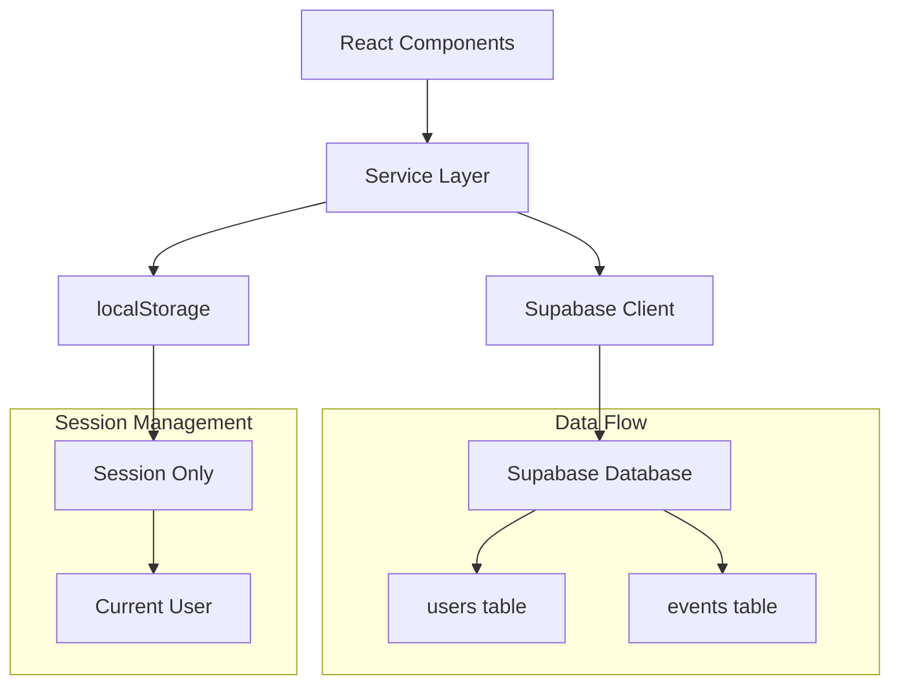
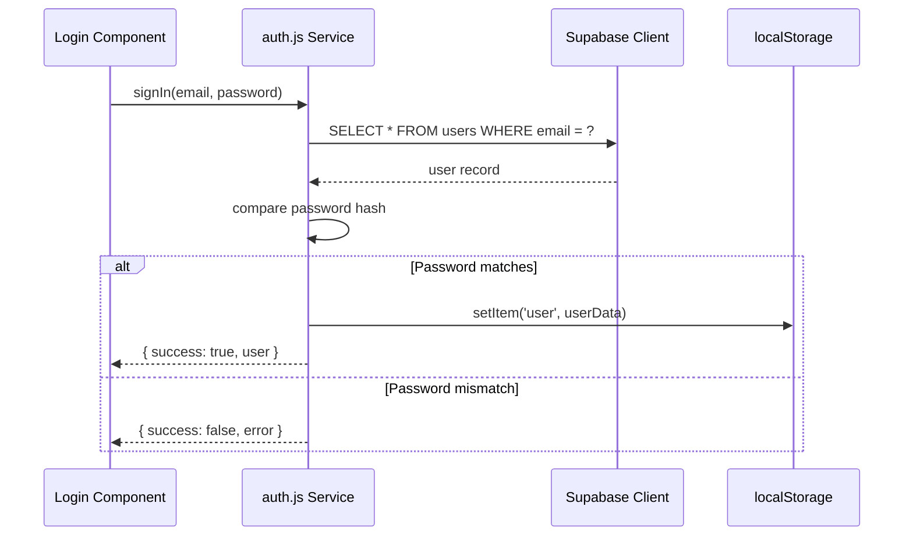
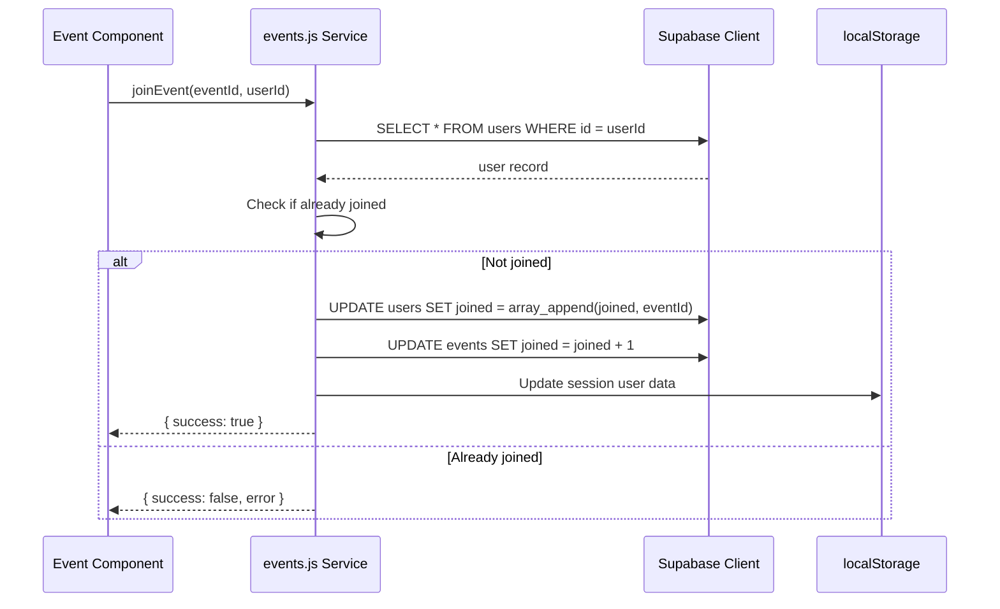
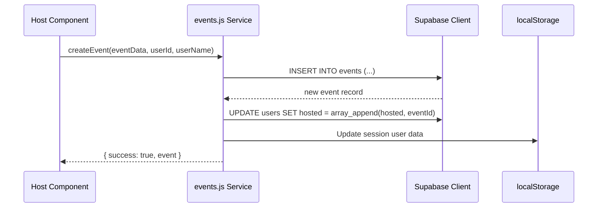

# Design Document: Supabase Data Migration

## Overview

This design outlines the migration from localStorage-based data storage to Supabase for the Milo event platform. The migration maintains the existing authentication flow (no Supabase Auth) while moving all user and event data to Supabase tables. The system will use Supabase exclusively for persistent data storage, with localStorage retained only for session management (storing the current logged-in user). This approach provides a scalable, centralized database while preserving the existing authentication UX.

The migration includes: (1) creating Supabase tables for users and events, (2) building a service layer to abstract database operations, (3) migrating existing default data to Supabase, and (4) updating all CRUD operations to use Supabase queries instead of localStorage manipulation.

## Architecture



## Sequence Diagrams

### User Authentication Flow




### Event Join Flow



### Event Creation Flow



## Components and Interfaces

### Component 1: Supabase Client

**Purpose**: Initialize and configure the Supabase client for database operations

**Interface**:
```typescript
interface SupabaseConfig {
  url: string
  anonKey: string
}

const supabase: SupabaseClient
```

**Responsibilities**:
- Initialize Supabase client with project credentials
- Provide singleton instance for all database operations
- Handle connection configuration


### Component 2: User Service

**Purpose**: Handle all user-related database operations

**Interface**:
```typescript
interface UserService {
  authenticateUser(email: string, password: string): Promise<AuthResult>
  registerUser(userData: UserRegistrationData): Promise<AuthResult>
  getActiveUser(): Promise<User | null>
  joinEvent(eventId: string, userId: number): Promise<OperationResult>
  leaveEvent(eventId: string, userId: number): Promise<OperationResult>
  addHostedEvent(eventId: string, userId: number): Promise<OperationResult>
  removeHostedEvent(eventId: string, userId: number): Promise<OperationResult>
}
```

**Responsibilities**:
- Query users table for authentication
- Create new user records
- Update user's joined and hosted event arrays
- Sync session data with database

### Component 3: Event Service

**Purpose**: Handle all event-related database operations

**Interface**:
```typescript
interface EventService {
  getAllEvents(): Promise<Event[]>
  getEventById(eventId: string): Promise<Event | null>
  createEvent(eventData: EventData, userId: number, userName: string): Promise<OperationResult>
  updateEvent(eventId: string, updates: Partial<Event>): Promise<OperationResult>
  deleteEvent(eventId: string): Promise<OperationResult>
  getEventParticipants(eventId: string): Promise<number>
  isUserHost(eventId: string, userId: number): Promise<boolean>
  hasUserJoined(eventId: string, userId: number): Promise<boolean>
}
```

**Responsibilities**:
- Query events table for all CRUD operations
- Manage event participant counts
- Coordinate with user service for join/leave operations


### Component 4: Migration Script

**Purpose**: One-time migration of existing default data to Supabase

**Interface**:
```typescript
interface MigrationService {
  migrateUsers(): Promise<MigrationResult>
  migrateEvents(): Promise<MigrationResult>
  runFullMigration(): Promise<void>
}
```

**Responsibilities**:
- Insert default users into Supabase users table
- Insert default events into Supabase events table
- Handle duplicate detection
- Report migration status

## Data Models

### Model 1: User

```typescript
interface User {
  id: number                    // Primary key, auto-increment
  email: string                 // Unique, not null
  password: string              // Hashed password, not null
  name: string                  // Not null
  dob: string                   // Format: "DD-MM-YYYY"
  occupation: string
  home: {
    country: string
    state: string
    city: string
  }                             // JSONB type in Supabase
  gender: string
  relationship: string
  interests: string[]           // Array of strings
  joined: string[]              // Array of event IDs
  hosted: string[]              // Array of event IDs
  avatar: string                // URL
  created_at: string            // ISO timestamp, auto-generated
}
```

**Validation Rules**:
- email must be unique and valid email format
- password must be at least 6 characters (hashed before storage)
- id is auto-incremented by database
- joined and hosted default to empty arrays
- created_at is auto-generated on insert


### Model 2: Event

```typescript
interface Event {
  id: string                    // Primary key, kebab-case string
  title: string                 // Not null
  host_id: number               // Foreign key to users.id
  host_name: string             // Denormalized for performance
  date: string                  // Format: "Day, Mon DD"
  time: string                  // Format: "HH:MM AM/PM"
  location: string
  image: string                 // URL or path
  tags: string[]                // Array of strings
  description: string
  spots: number                 // Total capacity
  joined: number                // Count of joined users
  created_at: string            // ISO timestamp, auto-generated
}
```

**Validation Rules**:
- id must be unique and kebab-case format
- host_id must reference valid user
- spots must be positive integer
- joined must be non-negative integer
- joined cannot exceed spots
- tags default to empty array
- created_at is auto-generated on insert

## Database Schema

### SQL Schema Definition

```sql
-- Users table
CREATE TABLE users (
  id BIGSERIAL PRIMARY KEY,
  email TEXT UNIQUE NOT NULL,
  password TEXT NOT NULL,
  name TEXT NOT NULL,
  dob TEXT,
  occupation TEXT,
  home JSONB,
  gender TEXT,
  relationship TEXT,
  interests TEXT[] DEFAULT '{}',
  joined TEXT[] DEFAULT '{}',
  hosted TEXT[] DEFAULT '{}',
  avatar TEXT,
  created_at TIMESTAMPTZ DEFAULT NOW()
);

-- Events table
CREATE TABLE events (
  id TEXT PRIMARY KEY,
  title TEXT NOT NULL,
  host_id BIGINT REFERENCES users(id) ON DELETE CASCADE,
  host_name TEXT NOT NULL,
  date TEXT,
  time TEXT,
  location TEXT,
  image TEXT,
  tags TEXT[] DEFAULT '{}',
  description TEXT,
  spots INTEGER DEFAULT 0,
  joined INTEGER DEFAULT 0,
  created_at TIMESTAMPTZ DEFAULT NOW()
);

-- Indexes for performance
CREATE INDEX idx_users_email ON users(email);
CREATE INDEX idx_events_host_id ON events(host_id);
CREATE INDEX idx_events_created_at ON events(created_at DESC);
```


## Algorithmic Pseudocode

### Main Authentication Algorithm

```typescript
async function authenticateUser(email: string, password: string): Promise<AuthResult> {
  // Preconditions:
  // - email is non-empty string
  // - password is non-empty string
  // - Supabase client is initialized
  
  // Step 1: Query user by email
  const { data: users, error } = await supabase
    .from('users')
    .select('*')
    .eq('email', email)
    .limit(1)
  
  if (error || !users || users.length === 0) {
    return { success: false, error: "Invalid email or password" }
  }
  
  const user = users[0]
  
  // Step 2: Compare password (plain text for now, hash comparison in future)
  if (user.password !== password) {
    return { success: false, error: "Invalid email or password" }
  }
  
  // Step 3: Store session in localStorage
  const sessionUser = {
    id: user.id,
    email: user.email,
    name: user.name,
    avatar: user.avatar,
    occupation: user.occupation,
    home: user.home,
    gender: user.gender,
    relationship: user.relationship,
    interests: user.interests,
    joined: user.joined || [],
    hosted: user.hosted || []
  }
  
  localStorage.setItem('user', JSON.stringify(sessionUser))
  localStorage.setItem('milo_current_user', JSON.stringify(sessionUser))
  
  // Postconditions:
  // - Returns success with user data if authentication succeeds
  // - Returns error if authentication fails
  // - Session is stored in localStorage on success
  
  return { success: true, user: sessionUser }
}
```

**Preconditions:**
- email is non-empty string
- password is non-empty string
- Supabase client is initialized and connected

**Postconditions:**
- Returns AuthResult with success flag
- If successful: user data stored in localStorage, returns user object
- If failed: returns error message
- No database mutations occur during authentication


### User Registration Algorithm

```typescript
async function registerUser(userData: UserRegistrationData): Promise<AuthResult> {
  // Preconditions:
  // - userData contains all required fields (email, password, name, etc.)
  // - email is valid format
  // - Supabase client is initialized
  
  // Step 1: Check if email already exists
  const { data: existing } = await supabase
    .from('users')
    .select('id')
    .eq('email', userData.email)
    .limit(1)
  
  if (existing && existing.length > 0) {
    return { success: false, error: "Email already registered" }
  }
  
  // Step 2: Create new user record
  const newUser = {
    email: userData.email,
    password: userData.password,  // TODO: Hash in production
    name: userData.name,
    dob: userData.dob,
    occupation: userData.occupation,
    home: {
      country: userData.country,
      state: userData.state,
      city: userData.city
    },
    gender: userData.gender,
    relationship: userData.relationship,
    interests: userData.interests,
    joined: [],
    hosted: [],
    avatar: `https://api.dicebear.com/7.x/avataaars/svg?seed=${encodeURIComponent(userData.name)}`
  }
  
  const { data: insertedUser, error } = await supabase
    .from('users')
    .insert(newUser)
    .select()
    .single()
  
  if (error || !insertedUser) {
    return { success: false, error: "Registration failed" }
  }
  
  // Step 3: Store session in localStorage
  const sessionUser = {
    id: insertedUser.id,
    email: insertedUser.email,
    name: insertedUser.name,
    avatar: insertedUser.avatar,
    occupation: insertedUser.occupation,
    home: insertedUser.home,
    gender: insertedUser.gender,
    relationship: insertedUser.relationship,
    interests: insertedUser.interests,
    joined: insertedUser.joined || [],
    hosted: insertedUser.hosted || []
  }
  
  localStorage.setItem('user', JSON.stringify(sessionUser))
  localStorage.setItem('milo_current_user', JSON.stringify(sessionUser))
  
  // Postconditions:
  // - New user record created in database
  // - Session stored in localStorage
  // - Returns success with user data
  
  return { success: true, user: sessionUser }
}
```

**Preconditions:**
- userData contains all required fields
- email is valid format and not empty
- password meets minimum requirements
- Supabase client is initialized

**Postconditions:**
- New user record inserted into users table
- User session stored in localStorage
- Returns success with user data or error message
- Email uniqueness is enforced


### Event Join Algorithm

```typescript
async function joinEvent(eventId: string, userId: number): Promise<OperationResult> {
  // Preconditions:
  // - eventId is valid event identifier
  // - userId is valid user identifier
  // - User is authenticated
  // - Supabase client is initialized
  
  // Step 1: Fetch user record
  const { data: user, error: userError } = await supabase
    .from('users')
    .select('joined')
    .eq('id', userId)
    .single()
  
  if (userError || !user) {
    return { success: false, error: "User not found" }
  }
  
  // Step 2: Check if already joined
  const joined = user.joined || []
  if (joined.includes(eventId)) {
    return { success: false, error: "Already joined this event" }
  }
  
  // Step 3: Update user's joined array
  const { error: updateUserError } = await supabase
    .from('users')
    .update({ joined: [...joined, eventId] })
    .eq('id', userId)
  
  if (updateUserError) {
    return { success: false, error: "Failed to join event" }
  }
  
  // Step 4: Increment event's joined count
  const { error: updateEventError } = await supabase
    .rpc('increment_event_joined', { event_id: eventId })
  
  if (updateEventError) {
    // Rollback user update
    await supabase
      .from('users')
      .update({ joined })
      .eq('id', userId)
    return { success: false, error: "Failed to update event" }
  }
  
  // Step 5: Update localStorage session
  const sessionUser = JSON.parse(localStorage.getItem('user') || '{}')
  sessionUser.joined = [...joined, eventId]
  localStorage.setItem('user', JSON.stringify(sessionUser))
  localStorage.setItem('milo_current_user', JSON.stringify(sessionUser))
  
  // Postconditions:
  // - User's joined array contains eventId
  // - Event's joined count incremented by 1
  // - Session updated in localStorage
  
  return { success: true }
}
```

**Preconditions:**
- eventId exists in events table
- userId exists in users table
- User has not already joined the event
- Supabase client is initialized

**Postconditions:**
- User's joined array contains eventId
- Event's joined count incremented by 1
- Session data synchronized with database
- Returns success or error with rollback on failure

**Loop Invariants:** N/A (no loops in this algorithm)


### Event Creation Algorithm

```typescript
async function createEvent(
  eventData: EventData, 
  userId: number, 
  userName: string
): Promise<OperationResult> {
  // Preconditions:
  // - eventData contains all required fields
  // - userId is valid user identifier
  // - userName is non-empty string
  // - User is authenticated
  // - Supabase client is initialized
  
  // Step 1: Generate unique event ID
  const eventId = generateKebabCaseId(eventData.title)
  
  // Step 2: Create event record
  const newEvent = {
    id: eventId,
    title: eventData.title,
    host_id: userId,
    host_name: userName,
    date: eventData.date,
    time: eventData.time,
    location: eventData.location,
    image: eventData.image,
    tags: eventData.tags || [],
    description: eventData.description,
    spots: eventData.spots,
    joined: 0
  }
  
  const { data: insertedEvent, error: insertError } = await supabase
    .from('events')
    .insert(newEvent)
    .select()
    .single()
  
  if (insertError || !insertedEvent) {
    return { success: false, error: "Failed to create event" }
  }
  
  // Step 3: Update user's hosted array
  const { data: user } = await supabase
    .from('users')
    .select('hosted')
    .eq('id', userId)
    .single()
  
  const hosted = user?.hosted || []
  
  const { error: updateUserError } = await supabase
    .from('users')
    .update({ hosted: [...hosted, eventId] })
    .eq('id', userId)
  
  if (updateUserError) {
    // Rollback event creation
    await supabase.from('events').delete().eq('id', eventId)
    return { success: false, error: "Failed to update user" }
  }
  
  // Step 4: Update localStorage session
  const sessionUser = JSON.parse(localStorage.getItem('user') || '{}')
  sessionUser.hosted = [...hosted, eventId]
  localStorage.setItem('user', JSON.stringify(sessionUser))
  localStorage.setItem('milo_current_user', JSON.stringify(sessionUser))
  
  // Postconditions:
  // - New event record created in database
  // - User's hosted array contains eventId
  // - Session updated in localStorage
  
  return { success: true, event: insertedEvent }
}
```

**Preconditions:**
- eventData contains all required fields (title, date, time, location, spots, etc.)
- userId exists in users table
- userName is non-empty string
- User is authenticated
- Supabase client is initialized

**Postconditions:**
- New event record inserted into events table
- User's hosted array contains new eventId
- Session data synchronized with database
- Returns success with event data or error with rollback on failure

**Loop Invariants:** N/A (no loops in this algorithm)


### Data Migration Algorithm

```typescript
async function migrateDefaultData(): Promise<void> {
  // Preconditions:
  // - Supabase tables (users, events) exist
  // - Default data arrays are defined
  // - Supabase client is initialized
  
  // Step 1: Migrate default users
  for (const user of defaultUsers) {
    // Check if user already exists
    const { data: existing } = await supabase
      .from('users')
      .select('id')
      .eq('email', user.email)
      .limit(1)
    
    if (!existing || existing.length === 0) {
      // Insert user with explicit ID
      await supabase
        .from('users')
        .insert({
          id: user.id,
          email: user.email,
          password: user.password,
          name: user.name,
          dob: user.dob,
          occupation: user.occupation,
          home: user.home,
          gender: user.gender,
          relationship: user.relationship,
          interests: user.interests,
          joined: user.joined,
          hosted: user.hosted,
          avatar: user.avatar
        })
    }
  }
  
  // Step 2: Migrate default events
  for (const event of defaultEvents) {
    // Check if event already exists
    const { data: existing } = await supabase
      .from('events')
      .select('id')
      .eq('id', event.id)
      .limit(1)
    
    if (!existing || existing.length === 0) {
      // Find host user ID by name
      const { data: hostUser } = await supabase
        .from('users')
        .select('id')
        .eq('name', event.host)
        .limit(1)
      
      const hostId = hostUser?.[0]?.id || 1  // Default to user 1 if not found
      
      // Insert event
      await supabase
        .from('events')
        .insert({
          id: event.id,
          title: event.title,
          host_id: hostId,
          host_name: event.host,
          date: event.date,
          time: event.time,
          location: event.location,
          image: event.image,
          tags: event.tags,
          description: event.description,
          spots: event.spots,
          joined: event.joined
        })
    }
  }
  
  // Postconditions:
  // - All default users exist in users table
  // - All default events exist in events table
  // - No duplicate records created
}
```

**Preconditions:**
- Supabase tables are created and accessible
- Default data arrays (defaultUsers, defaultEvents) are defined
- Supabase client is initialized and connected

**Postconditions:**
- All default users inserted into users table (if not already present)
- All default events inserted into events table (if not already present)
- Duplicate detection prevents re-insertion
- Foreign key relationships maintained (host_id references users.id)

**Loop Invariants:**
- For user migration loop: All previously processed users exist in database
- For event migration loop: All previously processed events exist in database


## Key Functions with Formal Specifications

### Function 1: getActiveUser()

```typescript
async function getActiveUser(): Promise<User | null>
```

**Preconditions:**
- localStorage is accessible
- Supabase client is initialized

**Postconditions:**
- Returns User object if valid session exists in localStorage
- Returns null if no session or invalid session
- No database queries if session is invalid
- Fetches fresh user data from database if session is valid

**Loop Invariants:** N/A

### Function 2: leaveEvent()

```typescript
async function leaveEvent(eventId: string, userId: number): Promise<OperationResult>
```

**Preconditions:**
- eventId exists in events table
- userId exists in users table
- User has joined the event (eventId in user.joined array)
- Supabase client is initialized

**Postconditions:**
- User's joined array no longer contains eventId
- Event's joined count decremented by 1
- Session data synchronized with database
- Returns success or error with rollback on failure

**Loop Invariants:** N/A

### Function 3: getAllEvents()

```typescript
async function getAllEvents(): Promise<Event[]>
```

**Preconditions:**
- Supabase client is initialized
- events table exists

**Postconditions:**
- Returns array of all events from database
- Returns empty array if no events exist
- Events are ordered by created_at descending
- No mutations to database

**Loop Invariants:** N/A

### Function 4: deleteEvent()

```typescript
async function deleteEvent(eventId: string): Promise<OperationResult>
```

**Preconditions:**
- eventId exists in events table
- Supabase client is initialized

**Postconditions:**
- Event record removed from events table
- All users' joined arrays updated to remove eventId
- All users' hosted arrays updated to remove eventId
- Returns success or error

**Loop Invariants:** N/A


## Example Usage

### Example 1: User Authentication

```typescript
// Login flow
import { signIn } from './services/auth'

const handleLogin = async (email: string, password: string) => {
  const result = await signIn(email, password)
  
  if (result.success) {
    console.log('Logged in:', result.user.name)
    // User session is now in localStorage
    // Navigate to dashboard
  } else {
    console.error('Login failed:', result.error)
  }
}

// Usage
await handleLogin('demo@milo.com', 'password123')
```

### Example 2: User Registration

```typescript
// Registration flow
import { signUp } from './services/auth'

const handleSignup = async (formData) => {
  const result = await signUp({
    email: formData.email,
    password: formData.password,
    name: formData.name,
    dob: formData.dob,
    occupation: formData.occupation,
    country: formData.country,
    state: formData.state,
    city: formData.city,
    gender: formData.gender,
    relationship: formData.relationship,
    interests: formData.interests
  })
  
  if (result.success) {
    console.log('Registered:', result.user.name)
    // User session is now in localStorage
    // Navigate to onboarding
  } else {
    console.error('Registration failed:', result.error)
  }
}
```

### Example 3: Event Operations

```typescript
// Join event
import { joinEvent } from './services/events'

const handleJoinEvent = async (eventId: string, userId: number) => {
  const result = await joinEvent(eventId, userId)
  
  if (result.success) {
    console.log('Joined event successfully')
    // Refresh UI to show updated state
  } else {
    console.error('Failed to join:', result.error)
  }
}

// Create event
import { createEvent } from './services/events'

const handleCreateEvent = async (eventData, user) => {
  const result = await createEvent(eventData, user.id, user.name)
  
  if (result.success) {
    console.log('Event created:', result.event.id)
    // Navigate to event details
  } else {
    console.error('Failed to create event:', result.error)
  }
}

// Get all events
import { getAllEvents } from './services/events'

const loadEvents = async () => {
  const events = await getAllEvents()
  console.log(`Loaded ${events.length} events`)
  return events
}
```


### Example 4: Data Migration

```typescript
// Run migration script
import { migrateDefaultData } from './services/migration'

const runMigration = async () => {
  console.log('Starting data migration...')
  
  try {
    await migrateDefaultData()
    console.log('Migration completed successfully')
  } catch (error) {
    console.error('Migration failed:', error)
  }
}

// Run once during deployment
await runMigration()
```

### Example 5: Session Management

```typescript
// Get current user from session
import { getCurrentUser } from './services/auth'

const checkAuth = async () => {
  const user = await getCurrentUser()
  
  if (user) {
    console.log('User is logged in:', user.name)
    return user
  } else {
    console.log('No active session')
    return null
  }
}

// Logout
import { signOut } from './services/auth'

const handleLogout = async () => {
  const result = await signOut()
  
  if (result.success) {
    console.log('Logged out successfully')
    // Navigate to login page
  }
}
```

## Correctness Properties

*A property is a characteristic or behavior that should hold true across all valid executions of a system—essentially, a formal statement about what the system should do. Properties serve as the bridge between human-readable specifications and machine-verifiable correctness guarantees.*

### Property 1: Authentication Integrity

*For any* email and password combination, authentication succeeds if and only if a user with matching email and password exists in the database.

**Validates: Requirements 1.1, 1.3**

### Property 2: Email Uniqueness

*For any* two distinct users in the database, their email addresses must be different.

**Validates: Requirements 2.3, 10.3**

### Property 3: Event Join Idempotency

*For any* user and event, joining the same event multiple times results in the event ID appearing exactly once in the user's joined array.

**Validates: Requirements 6.1, 6.4**

### Property 4: Event Capacity Constraint

*For any* event in the database, the number of users who have joined is always non-negative and never exceeds the event's capacity.

**Validates: Requirements 11.5, 11.6**

### Property 5: Host-Event Relationship

*For any* event in the database, the event's host_id references a valid user, and that user's hosted array contains the event ID.

**Validates: Requirements 5.3, 10.4**

### Property 6: Session-Database Consistency

*For any* user session stored in localStorage, if the user exists in the database, then the session's joined and hosted arrays match the database values.

**Validates: Requirements 13.1, 13.2, 13.3, 13.4, 13.5**

### Property 7: Event Deletion Cascade

*For any* event that is deleted, the event ID is removed from all users' joined and hosted arrays in the database.

**Validates: Requirements 8.3, 8.4**

### Property 8: Successful Authentication Creates Session

*For any* successful authentication or registration, the user session is stored in localStorage with all required fields.

**Validates: Requirements 1.2, 1.4, 2.5**

### Property 9: New User Initialization

*For any* newly registered user, the joined and hosted arrays are initialized as empty arrays.

**Validates: Requirements 2.6**

### Property 10: Event Response Completeness

*For any* event retrieved from the database, the response includes all required fields: id, title, host_id, host_name, date, time, location, image, tags, description, spots, joined count, and created_at.

**Validates: Requirements 4.4**

### Property 11: Join Operation Updates

*For any* successful event join operation, the user's joined array contains the event ID and the event's joined count is incremented by exactly one.

**Validates: Requirements 6.2, 6.3**

### Property 12: Leave Operation Updates

*For any* successful event leave operation, the user's joined array no longer contains the event ID and the event's joined count is decremented by exactly one.

**Validates: Requirements 7.2, 7.3**

### Property 13: Event Creation Initialization

*For any* newly created event, the joined count is initialized to zero and the event ID is added to the host user's hosted array.

**Validates: Requirements 5.4, 5.3**

### Property 14: Authorization Enforcement

*For any* event deletion attempt, the operation succeeds only if the requesting user is the host of that event.

**Validates: Requirements 8.1, 8.5**

### Property 15: Email Validation

*For any* email string submitted for authentication or registration, the system validates the email format before querying the database.

**Validates: Requirements 2.1, 11.1**

### Property 16: Password Validation

*For any* password submitted for registration, the system validates the password is at least 6 characters long.

**Validates: Requirements 11.2**

### Property 17: Event Data Validation

*For any* event creation request, the system validates that all required fields are present (title, date, time, location, spots) and that spots is a positive integer.

**Validates: Requirements 11.3, 11.4**

### Property 18: Error Isolation

*For any* authentication error, the localStorage session data remains unchanged.

**Validates: Requirements 12.5**

### Property 19: Password Field Exclusion

*For any* user query response, the password field is never included in the returned data.

**Validates: Requirements 15.2**

### Property 20: Input Validation Before Database Operations

*For any* user input, the system validates and sanitizes the input before performing database operations.

**Validates: Requirements 15.3**

### Property 21: Event Ordering

*For any* request to retrieve all events, the returned events are ordered by creation date in descending order.

**Validates: Requirements 4.2**

### Property 22: Session Restoration

*For any* valid session in localStorage when the application loads, the system restores the user's authenticated state.

**Validates: Requirements 3.3**

### Property 23: Leave Operation Validation

*For any* user attempting to leave an event, the operation succeeds only if the user has previously joined that event.

**Validates: Requirements 7.1, 7.4**

### Property 24: Duplicate Email Registration Prevention

*For any* registration attempt with an email that already exists in the database, the system returns an error without creating a new user record.

**Validates: Requirements 2.3**

### Property 25: Avatar Generation

*For any* newly registered user, the system generates a unique avatar URL using the user's name.

**Validates: Requirements 2.4**

### Property 26: Event ID Uniqueness

*For any* event creation, the system generates a unique event ID in kebab-case format.

**Validates: Requirements 5.1**

### Property 27: Foreign Key Cascade

*For any* user deletion, all events hosted by that user are also deleted from the database.

**Validates: Requirements 10.4**

## Error Handling

### Error Scenario 1: Database Connection Failure

**Condition:** Supabase client cannot connect to database (network error, invalid credentials, etc.)

**Response:** 
- All database operations return error result: `{ success: false, error: "Database connection failed" }`
- No localStorage mutations occur
- User sees error toast notification

**Recovery:** 
- Retry connection with exponential backoff
- Fall back to cached data in localStorage if available
- Prompt user to check internet connection


### Error Scenario 2: Duplicate Email Registration

**Condition:** User attempts to register with an email that already exists in the database

**Response:** 
- `registerUser()` returns `{ success: false, error: "Email already registered" }`
- No database insertion occurs
- No localStorage mutation occurs

**Recovery:** 
- Prompt user to use a different email
- Offer "Forgot Password" flow
- Suggest logging in instead

### Error Scenario 3: Event Capacity Exceeded

**Condition:** User attempts to join an event that has reached maximum capacity

**Response:** 
- `joinEvent()` checks if `event.joined >= event.spots`
- Returns `{ success: false, error: "Event is full" }`
- No database mutations occur

**Recovery:** 
- Show "Event Full" message to user
- Offer waitlist functionality (future enhancement)
- Suggest similar events

### Error Scenario 4: Invalid User Session

**Condition:** localStorage contains user session but user no longer exists in database (deleted account)

**Response:** 
- `getActiveUser()` queries database and finds no matching user
- Clears localStorage session
- Returns `null`

**Recovery:** 
- Redirect user to login page
- Show "Session expired" message
- Clear all localStorage data

### Error Scenario 5: Transaction Rollback Failure

**Condition:** During `joinEvent()`, user update succeeds but event update fails

**Response:** 
- Attempt to rollback user update
- If rollback succeeds: return error, no state change
- If rollback fails: log critical error, return error with warning

**Recovery:** 
- Log error to monitoring service
- Show error message to user
- Suggest refreshing the page
- Run data consistency check in background

### Error Scenario 6: Migration Duplicate Detection

**Condition:** Migration script runs multiple times

**Response:** 
- Check for existing records before insertion
- Skip records that already exist
- Log skipped records
- Continue with remaining records

**Recovery:** 
- Migration is idempotent
- No duplicate data created
- Complete successfully even if partially run before


## Testing Strategy

### Unit Testing Approach

**Test Coverage Goals:**
- 80%+ code coverage for service layer functions
- 100% coverage for critical authentication and data mutation functions
- Mock Supabase client for isolated unit tests

**Key Test Cases:**

1. **Authentication Tests**
   - Valid credentials return success
   - Invalid credentials return error
   - Non-existent email returns error
   - Session is stored in localStorage on success

2. **Registration Tests**
   - Valid data creates new user
   - Duplicate email returns error
   - Missing required fields returns error
   - Generated avatar URL is valid

3. **Event Join Tests**
   - User can join available event
   - Cannot join same event twice
   - Cannot join full event
   - Joined count increments correctly

4. **Event Creation Tests**
   - Valid data creates new event
   - Host is added to user's hosted array
   - Event ID is unique
   - Foreign key relationship is maintained

5. **Data Migration Tests**
   - Default users are inserted
   - Default events are inserted
   - Duplicate detection works
   - Migration is idempotent

### Property-Based Testing Approach

**Property Test Library:** fast-check (JavaScript/TypeScript)

**Properties to Test:**

1. **Email Uniqueness Property**
   ```typescript
   // Generate random user registrations
   // Verify no two users have same email
   fc.assert(
     fc.property(fc.array(fc.emailAddress()), (emails) => {
       const uniqueEmails = new Set(emails)
       return uniqueEmails.size === emails.length
     })
   )
   ```

2. **Event Join Idempotency Property**
   ```typescript
   // Join same event multiple times
   // Verify user.joined contains eventId exactly once
   fc.assert(
     fc.property(fc.string(), fc.integer(), async (eventId, userId) => {
       await joinEvent(eventId, userId)
       await joinEvent(eventId, userId)
       const user = await getUserById(userId)
       return user.joined.filter(id => id === eventId).length === 1
     })
   )
   ```

3. **Event Capacity Property**
   ```typescript
   // Generate random join operations
   // Verify joined count never exceeds spots
   fc.assert(
     fc.property(fc.integer(1, 100), async (spots) => {
       const event = await createEvent({ spots, ... })
       // Simulate multiple joins
       const event = await getEventById(event.id)
       return event.joined <= event.spots && event.joined >= 0
     })
   )
   ```

4. **Session Consistency Property**
   ```typescript
   // Perform random operations
   // Verify localStorage session matches database
   fc.assert(
     fc.property(fc.integer(), async (userId) => {
       const sessionUser = JSON.parse(localStorage.getItem('user'))
       const dbUser = await getUserById(userId)
       return JSON.stringify(sessionUser.joined) === JSON.stringify(dbUser.joined)
     })
   )
   ```


### Integration Testing Approach

**Test Environment:**
- Use Supabase local development instance or test project
- Seed test database with known data
- Clean up after each test suite

**Integration Test Cases:**

1. **End-to-End Authentication Flow**
   - Register new user → verify in database
   - Login with credentials → verify session
   - Logout → verify session cleared
   - Login again → verify session restored

2. **End-to-End Event Flow**
   - Create event → verify in database
   - Join event → verify user.joined and event.joined updated
   - Leave event → verify counts decremented
   - Delete event → verify removed from all users

3. **Data Migration Integration**
   - Run migration script
   - Verify all default users exist
   - Verify all default events exist
   - Run migration again → verify no duplicates

4. **Concurrent Operations**
   - Multiple users join same event simultaneously
   - Verify final joined count is correct
   - Verify no race conditions

5. **Error Recovery**
   - Simulate network failure during operation
   - Verify rollback occurs
   - Verify data consistency maintained

## Performance Considerations

### Database Indexing

**Indexes Created:**
- `idx_users_email` on `users(email)` - for fast authentication lookups
- `idx_events_host_id` on `events(host_id)` - for host-based queries
- `idx_events_created_at` on `events(created_at DESC)` - for chronological listing

**Query Optimization:**
- Use `.select()` to fetch only required fields
- Use `.limit()` for pagination
- Use `.single()` when expecting one result
- Avoid N+1 queries by batching operations

### Caching Strategy

**Session Caching:**
- Store current user in localStorage to avoid repeated database queries
- Refresh from database only when needed (login, profile update, event join/leave)

**Event List Caching:**
- Consider implementing client-side cache for event list
- Invalidate cache on create/update/delete operations
- Use Supabase real-time subscriptions for live updates (future enhancement)

### Expected Performance Metrics

- Authentication query: < 100ms
- Event list query: < 200ms (for 100 events)
- Join/leave event: < 300ms (includes two updates)
- Create event: < 400ms (includes user update)
- Migration script: < 5 seconds (for default data)


## Security Considerations

### Password Security

**Current State:** Passwords stored in plain text

**Immediate Concern:** This is a security vulnerability

**Mitigation Plan:**
1. Implement password hashing using bcrypt or argon2
2. Hash passwords before storing in database
3. Compare hashed passwords during authentication
4. Never return password field in API responses

**Implementation:**
```typescript
import bcrypt from 'bcrypt'

// During registration
const hashedPassword = await bcrypt.hash(password, 10)

// During authentication
const isValid = await bcrypt.compare(password, user.password)
```

### Row Level Security (RLS)

**Supabase RLS Policies:**

1. **Users Table:**
   - Users can read their own record
   - Users can update their own record (except email, password)
   - Only authenticated users can read other users' public fields
   - No direct password field access

2. **Events Table:**
   - Anyone can read events (public data)
   - Only event host can update/delete their events
   - Authenticated users can create events

**Example RLS Policies:**
```sql
-- Users can read their own data
CREATE POLICY "Users can read own data"
ON users FOR SELECT
USING (auth.uid() = id::text);

-- Users can update their own profile
CREATE POLICY "Users can update own profile"
ON users FOR UPDATE
USING (auth.uid() = id::text);

-- Anyone can read events
CREATE POLICY "Events are publicly readable"
ON events FOR SELECT
TO public
USING (true);

-- Only host can delete their events
CREATE POLICY "Hosts can delete own events"
ON events FOR DELETE
USING (auth.uid() = host_id::text);
```

**Note:** Since we're not using Supabase Auth, RLS policies will need to be adapted or we'll rely on service-level authorization checks.

### Data Validation

**Input Validation:**
- Validate email format before database query
- Sanitize user input to prevent SQL injection (Supabase client handles this)
- Validate required fields before insertion
- Enforce data type constraints

**Authorization Checks:**
- Verify user is logged in before mutations
- Verify user owns resource before update/delete
- Check event capacity before allowing join
- Verify host relationship before event deletion


### API Key Security

**Current Setup:**
- Supabase URL: `https://tonoebhxwstswtzgooxj.supabase.co`
- Anon Key: Public key (safe to expose in client-side code)

**Security Notes:**
- Anon key is designed for client-side use
- RLS policies enforce data access rules
- Service role key should NEVER be exposed in client code
- Use environment variables for configuration

**Environment Variables:**
```typescript
// .env file
VITE_SUPABASE_URL=https://tonoebhxwstswtzgooxj.supabase.co
VITE_SUPABASE_ANON_KEY=eyJhbGciOiJIUzI1NiIsInR5cCI6IkpXVCJ9...

// Usage in code
const supabaseUrl = import.meta.env.VITE_SUPABASE_URL
const supabaseAnonKey = import.meta.env.VITE_SUPABASE_ANON_KEY
```

## Dependencies

### Required Dependencies

1. **@supabase/supabase-js** (v2.105.4)
   - Already installed
   - Supabase JavaScript client library
   - Handles database queries, real-time subscriptions, authentication

2. **bcrypt** or **bcryptjs** (future enhancement)
   - For password hashing
   - bcryptjs is pure JavaScript (no native dependencies)
   - Recommended: `npm install bcryptjs`

### Development Dependencies

1. **fast-check** (v4.8.0)
   - Already installed
   - Property-based testing library
   - Used for testing correctness properties

2. **vitest** (v4.1.6)
   - Already installed
   - Unit testing framework
   - Used for service layer tests

3. **@testing-library/react** (v16.3.2)
   - Already installed
   - Component testing utilities
   - Used for integration tests

### External Services

1. **Supabase Project**
   - URL: `https://tonoebhxwstswtzgooxj.supabase.co`
   - Database: PostgreSQL
   - Required tables: users, events
   - Required RPC functions: increment_event_joined

2. **DiceBear API**
   - Avatar generation service
   - URL: `https://api.dicebear.com/7.x/avataaars/svg`
   - Used for generating user avatars
   - No authentication required

## Migration Checklist

### Phase 1: Database Setup
- [ ] Create users table in Supabase
- [ ] Create events table in Supabase
- [ ] Create indexes for performance
- [ ] Create RPC function for increment_event_joined
- [ ] Test database connectivity

### Phase 2: Service Layer Implementation
- [ ] Create supabaseClient.js with initialized client
- [ ] Update auth.js to use Supabase queries
- [ ] Update users.js to use Supabase queries
- [ ] Update events.js to use Supabase queries
- [ ] Implement error handling and rollback logic

### Phase 3: Data Migration
- [ ] Create migration script
- [ ] Run migration for default users
- [ ] Run migration for default events
- [ ] Verify data integrity
- [ ] Test migration idempotency

### Phase 4: Testing
- [ ] Write unit tests for all service functions
- [ ] Write property-based tests for correctness properties
- [ ] Write integration tests for end-to-end flows
- [ ] Test error scenarios and recovery
- [ ] Test concurrent operations

### Phase 5: Deployment
- [ ] Update environment variables
- [ ] Deploy database schema to production
- [ ] Run migration script in production
- [ ] Monitor for errors
- [ ] Verify all features work correctly

### Phase 6: Cleanup
- [ ] Remove old localStorage-based code
- [ ] Update documentation
- [ ] Add password hashing (security enhancement)
- [ ] Implement RLS policies (if using Supabase Auth in future)
