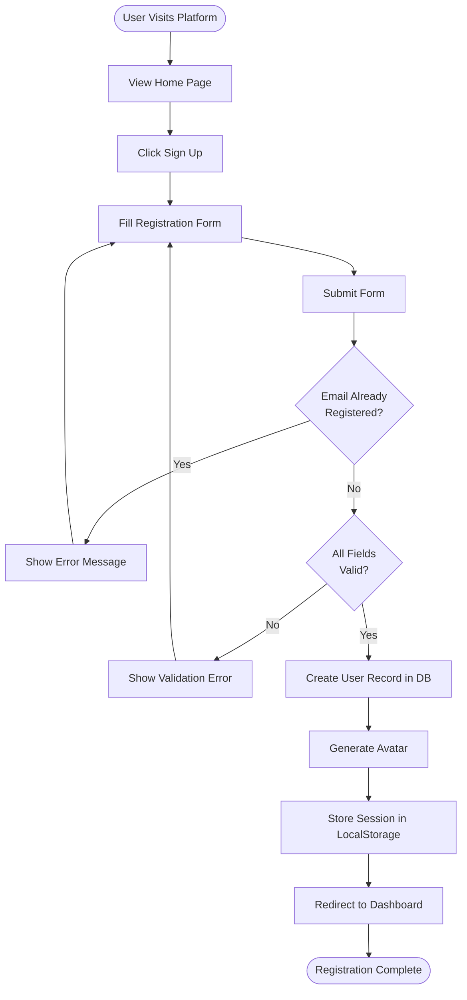
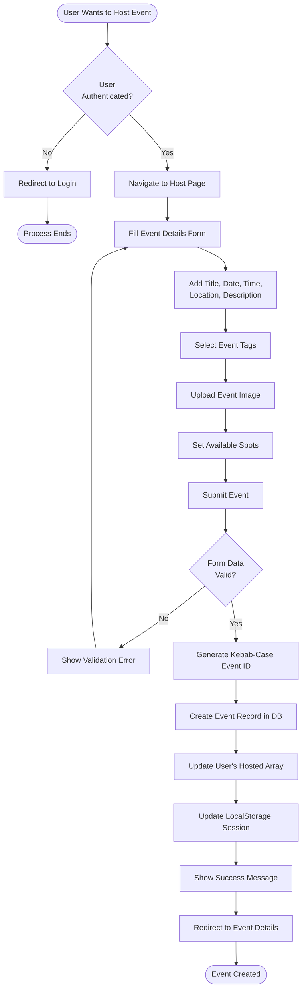
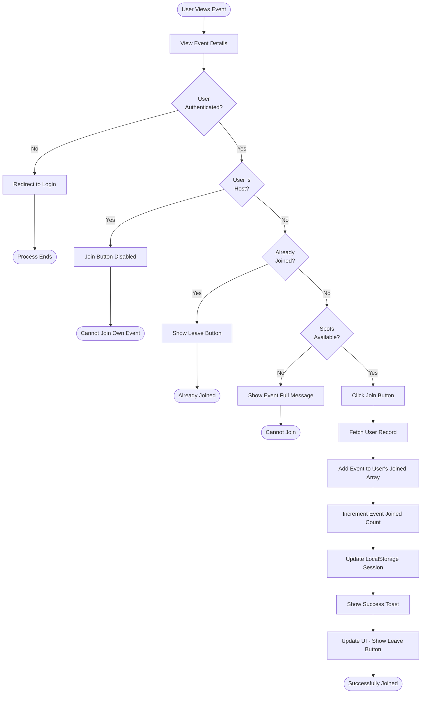
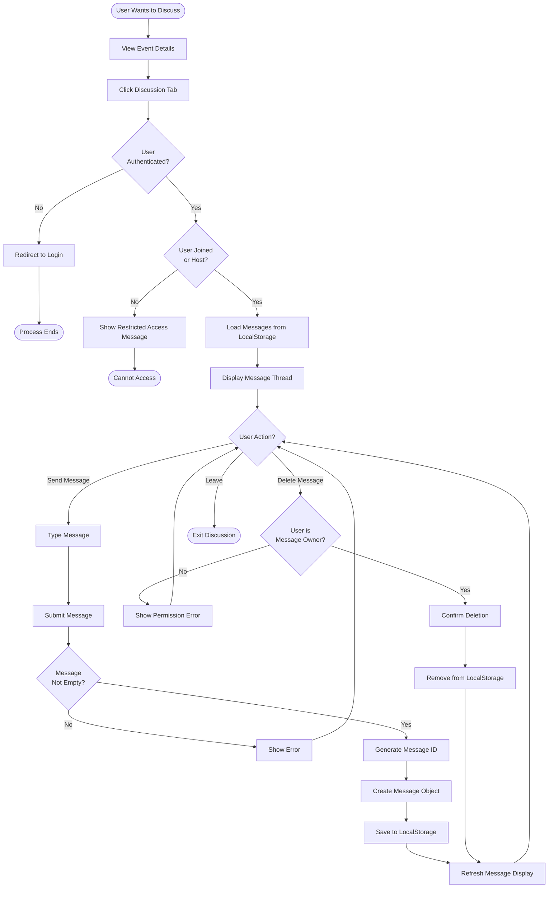
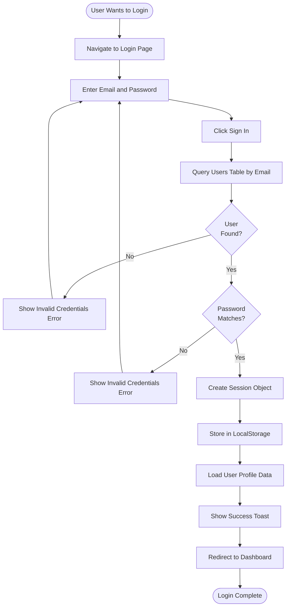

# Activity Diagrams - Milo Event Platform

## 1. User Registration Activity Diagram

## 2. Event Creation Activity Diagram

## 3. Join Event Activity Diagram

## 4. Event Discussion Activity Diagram

## 5. User Authentication Activity Diagram

