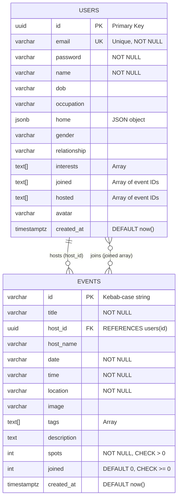

# Database Design - Milo Event Platform

## Database Architecture Overview

The Milo platform uses a **hybrid storage architecture**:
- **Supabase (PostgreSQL)**: Primary database for users and events
- **LocalStorage**: Browser-based storage for sessions and messages

## Database Schema



## Table Specifications

### 1. USERS Table

**Purpose**: Store user account information and profile data

**SQL Schema**:
```sql
CREATE TABLE users (
    id UUID PRIMARY KEY DEFAULT gen_random_uuid(),
    email VARCHAR(255) UNIQUE NOT NULL,
    password VARCHAR(255) NOT NULL,
    name VARCHAR(255) NOT NULL,
    dob VARCHAR(50),
    occupation VARCHAR(255),
    home JSONB,
    gender VARCHAR(50),
    relationship VARCHAR(50),
    interests TEXT[],
    joined TEXT[] DEFAULT '{}',
    hosted TEXT[] DEFAULT '{}',
    avatar VARCHAR(500),
    created_at TIMESTAMPTZ DEFAULT now()
);

-- Indexes
CREATE UNIQUE INDEX idx_users_email ON users(email);
CREATE INDEX idx_users_id ON users(id);
CREATE INDEX idx_users_created_at ON users(created_at);
```

**Column Details**:

| Column | Type | Constraints | Description |
|--------|------|-------------|-------------|
| id | UUID | PRIMARY KEY, DEFAULT gen_random_uuid() | Unique user identifier |
| email | VARCHAR(255) | UNIQUE, NOT NULL | User email address |
| password | VARCHAR(255) | NOT NULL | User password (plain text - needs hashing) |
| name | VARCHAR(255) | NOT NULL | User full name |
| dob | VARCHAR(50) | NULL | Date of birth |
| occupation | VARCHAR(255) | NULL | User occupation |
| home | JSONB | NULL | JSON: {country, state, city} |
| gender | VARCHAR(50) | NULL | User gender |
| relationship | VARCHAR(50) | NULL | Relationship status |
| interests | TEXT[] | NULL | Array of interest tags |
| joined | TEXT[] | DEFAULT '{}' | Array of joined event IDs |
| hosted | TEXT[] | DEFAULT '{}' | Array of hosted event IDs |
| avatar | VARCHAR(500) | NULL | Avatar URL from DiceBear |
| created_at | TIMESTAMPTZ | DEFAULT now() | Account creation timestamp |

**Sample Data**:
```json
{
  "id": "550e8400-e29b-41d4-a716-446655440000",
  "email": "demo@milo.com",
  "password": "password123",
  "name": "Demo User",
  "dob": "23-09-2005",
  "occupation": "Product Designer",
  "home": {
    "country": "India",
    "state": "Rajasthan",
    "city": "Jaipur"
  },
  "gender": "male",
  "relationship": "Single",
  "interests": ["sports", "art", "music"],
  "joined": ["sunday-brunch-club", "sunrise-run-club"],
  "hosted": ["watercolor-workshop"],
  "avatar": "https://api.dicebear.com/7.x/avataaars/svg?seed=demo",
  "created_at": "2024-01-15T10:30:00Z"
}
```

### 2. EVENTS Table

**Purpose**: Store event information and metadata

**SQL Schema**:
```sql
CREATE TABLE events (
    id VARCHAR(255) PRIMARY KEY,
    title VARCHAR(500) NOT NULL,
    host_id UUID NOT NULL REFERENCES users(id) ON DELETE CASCADE,
    host_name VARCHAR(255),
    date VARCHAR(100) NOT NULL,
    time VARCHAR(100) NOT NULL,
    location VARCHAR(500) NOT NULL,
    image VARCHAR(500),
    tags TEXT[],
    description TEXT,
    spots INTEGER NOT NULL CHECK (spots > 0),
    joined INTEGER DEFAULT 0 CHECK (joined >= 0),
    created_at TIMESTAMPTZ DEFAULT now(),
    CONSTRAINT check_joined_spots CHECK (joined <= spots)
);

-- Indexes
CREATE INDEX idx_events_host_id ON events(host_id);
CREATE INDEX idx_events_created_at ON events(created_at);
CREATE INDEX idx_events_date ON events(date);
CREATE INDEX idx_events_tags ON events USING GIN(tags);

-- Foreign Key
ALTER TABLE events 
ADD CONSTRAINT fk_events_host 
FOREIGN KEY (host_id) 
REFERENCES users(id) 
ON DELETE CASCADE;
```

**Column Details**:

| Column | Type | Constraints | Description |
|--------|------|-------------|-------------|
| id | VARCHAR(255) | PRIMARY KEY | Kebab-case event identifier |
| title | VARCHAR(500) | NOT NULL | Event title |
| host_id | UUID | NOT NULL, FK to users(id) | Event host reference |
| host_name | VARCHAR(255) | NULL | Cached host name |
| date | VARCHAR(100) | NOT NULL | Event date (string format) |
| time | VARCHAR(100) | NOT NULL | Event time (string format) |
| location | VARCHAR(500) | NOT NULL | Event location |
| image | VARCHAR(500) | NULL | Event image URL |
| tags | TEXT[] | NULL | Array of category tags |
| description | TEXT | NULL | Event description |
| spots | INTEGER | NOT NULL, CHECK > 0 | Total available spots |
| joined | INTEGER | DEFAULT 0, CHECK >= 0 | Current participant count |
| created_at | TIMESTAMPTZ | DEFAULT now() | Event creation timestamp |

**Constraints**:
- `CHECK (spots > 0)`: Events must have at least 1 spot
- `CHECK (joined >= 0)`: Joined count cannot be negative
- `CHECK (joined <= spots)`: Cannot exceed available spots

**Sample Data**:
```json
{
  "id": "sunday-brunch-club-a1b2",
  "title": "Sunday Brunch Club",
  "host_id": "550e8400-e29b-41d4-a716-446655440000",
  "host_name": "Ananya Sharma",
  "date": "Sun, May 18",
  "time": "11:00 AM",
  "location": "C-Scheme, Jaipur",
  "image": "/assets/event-brunch.jpg",
  "tags": ["Brunches", "Food"],
  "description": "Slow Sunday mornings, fresh pancakes...",
  "spots": 10,
  "joined": 3,
  "created_at": "2024-05-10T08:00:00Z"
}
```

### 3. Database Functions (Supabase)

**Increment Event Joined Count**:
```sql
CREATE OR REPLACE FUNCTION increment_event_joined(event_id VARCHAR)
RETURNS VOID AS $$
BEGIN
    UPDATE events 
    SET joined = joined + 1 
    WHERE id = event_id 
    AND joined < spots;
END;
$$ LANGUAGE plpgsql;
```

**Decrement Event Joined Count**:
```sql
CREATE OR REPLACE FUNCTION decrement_event_joined(event_id VARCHAR)
RETURNS VOID AS $$
BEGIN
    UPDATE events 
    SET joined = joined - 1 
    WHERE id = event_id 
    AND joined > 0;
END;
$$ LANGUAGE plpgsql;
```

## LocalStorage Schema

### Session Store

**Key**: `user` or `milo_current_user`

**Structure**:
```json
{
  "id": "uuid",
  "email": "string",
  "name": "string",
  "avatar": "string",
  "occupation": "string",
  "home": {
    "country": "string",
    "state": "string",
    "city": "string"
  },
  "gender": "string",
  "relationship": "string",
  "interests": ["string"],
  "joined": ["event_id"],
  "hosted": ["event_id"]
}
```

### Messages Store

**Key**: `milo_messages`

**Structure**:
```json
[
  {
    "id": "uuid",
    "event_id": "string",
    "user_id": "uuid",
    "user_name": "string",
    "user_avatar": "string",
    "message": "string",
    "is_bot": false,
    "created_at": "ISO 8601 timestamp"
  }
]
```

## Relationships and Foreign Keys

### 1. USERS → EVENTS (Host Relationship)
- **Type**: One-to-Many
- **Foreign Key**: `events.host_id` → `users.id`
- **On Delete**: CASCADE (delete events when host is deleted)
- **Implementation**: Direct foreign key constraint

### 2. USERS ↔ EVENTS (Join Relationship)
- **Type**: Many-to-Many
- **Implementation**: Array-based (denormalized)
  - `users.joined[]` contains event IDs
  - `events.joined` counter tracks total participants
- **No Junction Table**: Uses PostgreSQL array types

## Indexes Strategy

### USERS Table Indexes
```sql
-- Primary access pattern: lookup by email (login)
CREATE UNIQUE INDEX idx_users_email ON users(email);

-- Secondary access: lookup by ID (session validation)
CREATE INDEX idx_users_id ON users(id);

-- Analytics: user registration trends
CREATE INDEX idx_users_created_at ON users(created_at);
```

### EVENTS Table Indexes
```sql
-- Primary access: lookup by host (user's hosted events)
CREATE INDEX idx_events_host_id ON events(host_id);

-- Secondary access: chronological listing
CREATE INDEX idx_events_created_at ON events(created_at);

-- Filter by date (upcoming events)
CREATE INDEX idx_events_date ON events(date);

-- Search by tags (event discovery)
CREATE INDEX idx_events_tags ON events USING GIN(tags);
```

## Data Integrity Rules

### 1. Referential Integrity
- Events must have valid host (enforced by FK)
- Cascade delete events when host is deleted
- Event IDs in user arrays should exist (not enforced)

### 2. Business Logic Constraints
- Email uniqueness (enforced by UNIQUE constraint)
- Positive spot count (enforced by CHECK constraint)
- Non-negative joined count (enforced by CHECK constraint)
- Joined ≤ spots (enforced by CHECK constraint)

### 3. Application-Level Constraints
- User cannot join own event (enforced in code)
- User cannot join same event twice (enforced in code)
- Only participants can access discussion (enforced in code)
- Only message owner can delete message (enforced in code)

## Normalization Analysis

### Current Normalization Level: **2NF (Second Normal Form)**

**Denormalization Decisions**:
1. **host_name in EVENTS**: Cached from USERS.name
   - **Reason**: Avoid JOIN on every event list query
   - **Trade-off**: Must update if user changes name

2. **joined[] array in USERS**: Stores event IDs
   - **Reason**: Fast lookup of user's events
   - **Trade-off**: Redundant with events.joined counter

3. **user_name, user_avatar in MESSAGES**: Cached from USERS
   - **Reason**: Avoid JOIN on message display
   - **Trade-off**: Must update if user changes profile

### Normalization to 3NF (Optional)

To achieve 3NF, create junction table:

```sql
CREATE TABLE event_participants (
    user_id UUID REFERENCES users(id) ON DELETE CASCADE,
    event_id VARCHAR(255) REFERENCES events(id) ON DELETE CASCADE,
    joined_at TIMESTAMPTZ DEFAULT now(),
    PRIMARY KEY (user_id, event_id)
);

CREATE INDEX idx_participants_user ON event_participants(user_id);
CREATE INDEX idx_participants_event ON event_participants(event_id);
```

**Benefits**:
- Eliminates array redundancy
- Better referential integrity
- Easier to query participant history

**Trade-offs**:
- Additional JOIN required
- More complex queries
- Slower for common operations

## Query Patterns

### Common Queries

**1. Get User's Joined Events**:
```sql
SELECT e.* 
FROM events e
WHERE e.id = ANY(
    SELECT unnest(joined) 
    FROM users 
    WHERE id = $user_id
);
```

**2. Get Event with Host Info**:
```sql
SELECT e.*, u.name as host_name, u.avatar as host_avatar
FROM events e
JOIN users u ON e.host_id = u.id
WHERE e.id = $event_id;
```

**3. Search Events by Tags**:
```sql
SELECT * 
FROM events
WHERE tags && ARRAY[$tag1, $tag2]
ORDER BY created_at DESC;
```

**4. Get Available Events**:
```sql
SELECT * 
FROM events
WHERE joined < spots
ORDER BY date ASC;
```

## Backup and Migration Strategy

### Backup Strategy
- **Supabase**: Automatic daily backups
- **LocalStorage**: No backup (ephemeral data)
- **Critical Data**: Users and Events (in Supabase)
- **Non-Critical**: Messages (in LocalStorage)

### Migration Considerations
1. **Password Hashing**: Migrate to bcrypt/argon2
2. **Messages to Supabase**: Create messages table
3. **Date/Time Format**: Migrate to proper TIMESTAMP
4. **Junction Table**: Migrate to event_participants table

## Security Considerations

### Current Issues
1. **Plain Text Passwords**: Need hashing (bcrypt)
2. **No Row-Level Security**: Supabase RLS not configured
3. **Client-Side Auth**: No server-side validation
4. **No API Rate Limiting**: Vulnerable to abuse

### Recommended Improvements
```sql
-- Enable Row Level Security
ALTER TABLE users ENABLE ROW LEVEL SECURITY;
ALTER TABLE events ENABLE ROW LEVEL SECURITY;

-- Users can only read their own data
CREATE POLICY users_select_own 
ON users FOR SELECT 
USING (auth.uid() = id);

-- Users can update their own profile
CREATE POLICY users_update_own 
ON users FOR UPDATE 
USING (auth.uid() = id);

-- Anyone can read events
CREATE POLICY events_select_all 
ON events FOR SELECT 
TO authenticated 
USING (true);

-- Only host can update/delete event
CREATE POLICY events_update_own 
ON events FOR UPDATE 
USING (auth.uid() = host_id);

CREATE POLICY events_delete_own 
ON events FOR DELETE 
USING (auth.uid() = host_id);
```

## Performance Optimization

### Current Optimizations
1. **Denormalized host_name**: Reduces JOINs
2. **Array-based joins**: Fast user event lookup
3. **GIN index on tags**: Fast tag search
4. **LocalStorage for messages**: Reduces DB load

### Future Optimizations
1. **Materialized Views**: For event discovery
2. **Caching Layer**: Redis for hot data
3. **Read Replicas**: For scaling reads
4. **Partitioning**: By date for old events
