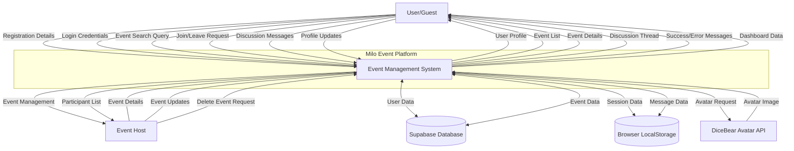
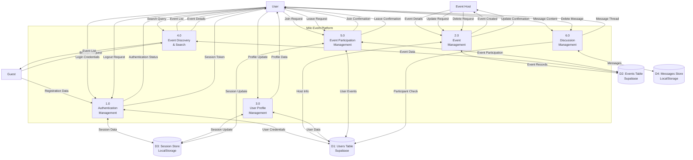
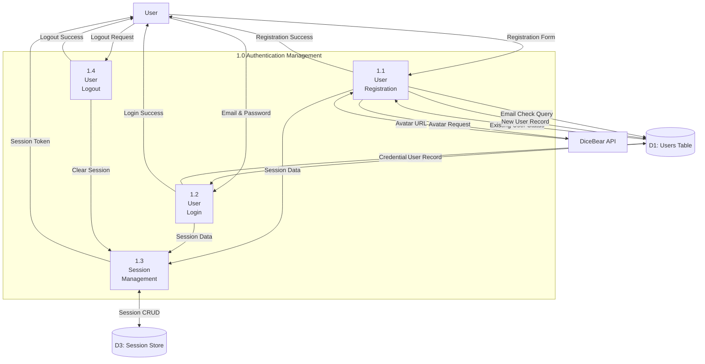
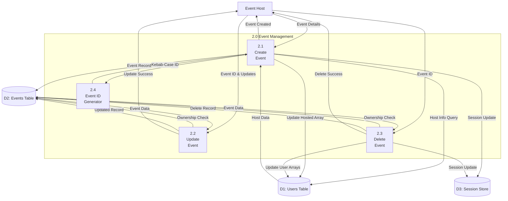
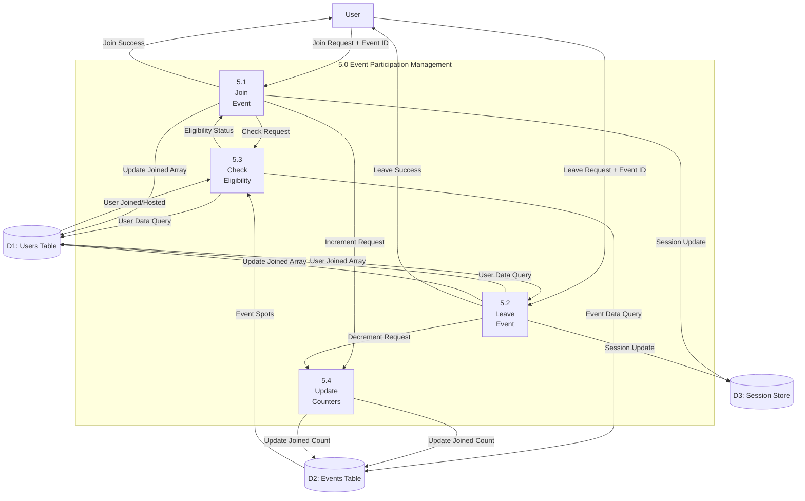

# Data Flow Diagrams - Milo Event Platform

## DFD Level 0 (Context Diagram)

## DFD Level 1 (Main Processes)

## DFD Level 2 - Authentication Management (Process 1.0)

## DFD Level 2 - Event Management (Process 2.0)

## DFD Level 2 - Event Participation (Process 5.0)

## Data Stores Description

### D1: Users Table (Supabase)
- **Purpose**: Store user account information and relationships
- **Data**: id, email, password, name, dob, occupation, home, gender, relationship, interests, joined[], hosted[], avatar, created_at
- **Access**: Read/Write by Authentication, Profile, Event, and Participation processes

### D2: Events Table (Supabase)
- **Purpose**: Store event information and metadata
- **Data**: id, title, host_id, host_name, date, time, location, image, tags[], description, spots, joined, created_at
- **Access**: Read/Write by Event Management, Discovery, and Participation processes

### D3: Session Store (LocalStorage)
- **Purpose**: Maintain user session state in browser
- **Data**: user object (id, email, name, avatar, occupation, home, gender, relationship, interests, joined[], hosted[])
- **Access**: Read/Write by Authentication and Session Management processes

### D4: Messages Store (LocalStorage)
- **Purpose**: Store event discussion messages
- **Data**: id, event_id, user_id, user_name, user_avatar, message, is_bot, created_at
- **Access**: Read/Write by Discussion Management process
