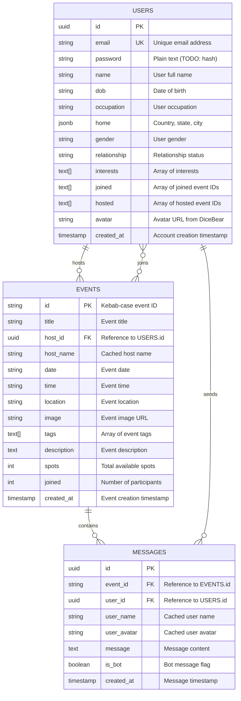

# Entity-Relationship Diagram - Milo Event Platform

## ER Diagram

## Entity Descriptions

### USERS Entity
**Description**: Represents registered users of the platform

**Attributes**:
- `id` (PK): Unique identifier (UUID) generated by Supabase
- `email` (UK): User's email address, must be unique
- `password`: User's password (currently plain text, needs hashing)
- `name`: User's full name
- `dob`: Date of birth
- `occupation`: User's occupation/profession
- `home`: JSON object containing country, state, and city
- `gender`: User's gender
- `relationship`: Relationship status
- `interests`: Array of user interests (tags)
- `joined`: Array of event IDs the user has joined
- `hosted`: Array of event IDs the user is hosting
- `avatar`: URL to user's avatar image from DiceBear API
- `created_at`: Timestamp of account creation

**Relationships**:
- One user can host many events (1:N with EVENTS)
- One user can join many events (M:N with EVENTS)
- One user can send many messages (1:N with MESSAGES)

### EVENTS Entity
**Description**: Represents events created by hosts

**Attributes**:
- `id` (PK): Kebab-case string ID generated from event title
- `title`: Event title/name
- `host_id` (FK): Reference to the hosting user's ID
- `host_name`: Cached name of the host (denormalized)
- `date`: Event date (string format)
- `time`: Event time (string format)
- `location`: Event location description
- `image`: URL to event image
- `tags`: Array of event category tags
- `description`: Detailed event description
- `spots`: Total number of available spots
- `joined`: Current number of participants
- `created_at`: Timestamp of event creation

**Relationships**:
- One event is hosted by one user (N:1 with USERS)
- One event can have many participants (M:N with USERS)
- One event can have many messages (1:N with MESSAGES)

**Business Rules**:
- `joined` count must not exceed `spots`
- Event ID is generated as kebab-case from title + random suffix
- Host cannot join their own event

### MESSAGES Entity
**Description**: Represents discussion messages within events

**Attributes**:
- `id` (PK): Unique identifier (UUID)
- `event_id` (FK): Reference to the event
- `user_id` (FK): Reference to the message sender
- `user_name`: Cached name of the sender (denormalized)
- `user_avatar`: Cached avatar URL of the sender (denormalized)
- `message`: Message text content
- `is_bot`: Boolean flag indicating if message is from a bot
- `created_at`: Timestamp of message creation

**Relationships**:
- One message belongs to one event (N:1 with EVENTS)
- One message is sent by one user (N:1 with USERS)

**Business Rules**:
- Only event participants (joined or host) can send messages
- Users can only delete their own messages
- Messages are stored in LocalStorage (not Supabase)

## Relationship Details

### HOSTS Relationship (USERS to EVENTS)
- **Type**: One-to-Many
- **Cardinality**: 1:N
- **Description**: A user can host multiple events, but each event has exactly one host
- **Implementation**: `EVENTS.host_id` references `USERS.id`
- **Cascade**: When user is deleted, their hosted events should be deleted

### JOINS Relationship (USERS to EVENTS)
- **Type**: Many-to-Many
- **Cardinality**: M:N
- **Description**: Users can join multiple events, and events can have multiple participants
- **Implementation**: 
  - `USERS.joined[]` array contains event IDs
  - `EVENTS.joined` counter tracks participant count
- **Business Rules**:
  - User cannot join if event is full (`joined >= spots`)
  - User cannot join their own hosted event
  - Joining increments `EVENTS.joined` counter
  - Leaving decrements `EVENTS.joined` counter

### CONTAINS Relationship (EVENTS to MESSAGES)
- **Type**: One-to-Many
- **Cardinality**: 1:N
- **Description**: An event can have multiple messages in its discussion
- **Implementation**: `MESSAGES.event_id` references `EVENTS.id`
- **Cascade**: When event is deleted, all its messages should be deleted

### SENDS Relationship (USERS to MESSAGES)
- **Type**: One-to-Many
- **Cardinality**: 1:N
- **Description**: A user can send multiple messages
- **Implementation**: `MESSAGES.user_id` references `USERS.id`
- **Cascade**: When user is deleted, their messages could be retained or deleted

## Cardinality Summary

| Relationship | From Entity | To Entity | Cardinality | Participation |
|--------------|-------------|-----------|-------------|---------------|
| Hosts | USERS | EVENTS | 1:N | Partial (not all users host) |
| Joins | USERS | EVENTS | M:N | Partial (optional participation) |
| Contains | EVENTS | MESSAGES | 1:N | Partial (events may have no messages) |
| Sends | USERS | MESSAGES | 1:N | Partial (users may not send messages) |

## Constraints and Business Rules

1. **User Constraints**:
   - Email must be unique
   - Password should be hashed (currently not implemented)
   - Interests must be from predefined list

2. **Event Constraints**:
   - Event ID must be unique
   - `joined` count cannot exceed `spots`
   - Host ID must reference valid user
   - Date and time must be in future (not enforced at DB level)

3. **Message Constraints**:
   - Message content cannot be empty
   - User must be participant or host to send message
   - Event ID must reference valid event
   - User ID must reference valid user

4. **Referential Integrity**:
   - `EVENTS.host_id` must exist in `USERS.id`
   - `MESSAGES.event_id` must exist in `EVENTS.id`
   - `MESSAGES.user_id` must exist in `USERS.id`
   - Event IDs in `USERS.joined[]` should exist in `EVENTS.id`
   - Event IDs in `USERS.hosted[]` should exist in `EVENTS.id`
