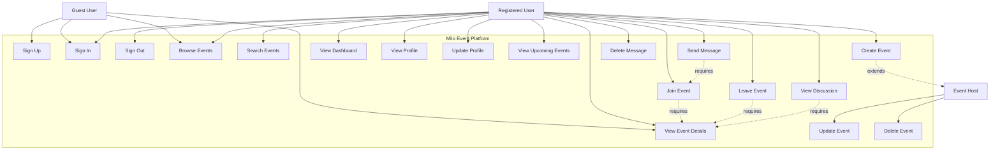

# Use Case Diagram - Milo Event Platform

## Actors

### Guest User
- Can browse events without authentication
- Can view event details
- Can sign up for an account
- Can sign in to existing account

### Registered User
- All Guest User capabilities
- Can join/leave events
- Can create new events (becomes Host)
- Can view personalized dashboard
- Can manage profile
- Can participate in event discussions
- Can view upcoming events they've joined

### Event Host
- All Registered User capabilities
- Can update their hosted events
- Can delete their hosted events
- Manages event participants

## Use Cases

1. **Sign Up**: Register a new account with personal details
2. **Sign In**: Authenticate with email and password
3. **Sign Out**: End current session
4. **Browse Events**: View all available events
5. **Search Events**: Filter events by tags, location, date
6. **View Event Details**: See complete event information
7. **Join Event**: Register for an event
8. **Leave Event**: Cancel event registration
9. **Create Event**: Host a new event
10. **Update Event**: Modify event details (host only)
11. **Delete Event**: Remove event (host only)
12. **View Dashboard**: See personalized event feed
13. **View Profile**: Access user profile information
14. **Update Profile**: Modify user details
15. **View Upcoming Events**: See joined events
16. **Send Message**: Post in event discussion
17. **View Discussion**: Read event messages
18. **Delete Message**: Remove own messages
